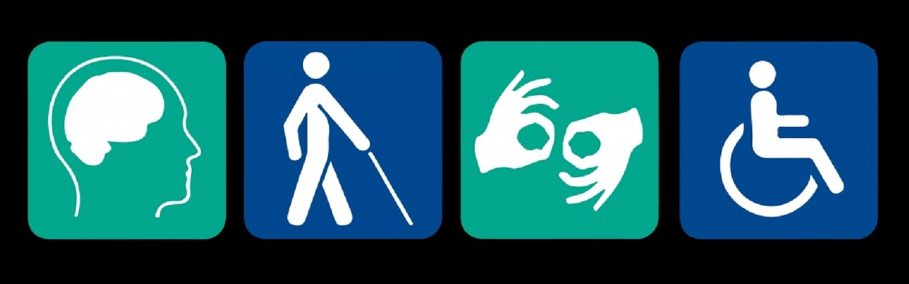

<!-- .slide: data-menu-title="Frontpage"; data-background-image="images/accessibility4pics.png"; data-background-opacity="0.2"; background-size:contain -->
# Training Toegankelijkheid
?-?-2023

Note:
- Printen: kan vanuit Chrome met url suffix: ?print-pdf
- f = full screen
- o = overview slides
- g = go to slide
- s = speaker notes
- v,b,.,/ = pause/resume

---

<!-- .slide: data-menu-title="Agenda" data-background-image="images/stopwatch.jpg" data-background-opacity="0.1" -->
## Agenda

 1. Introductie
 2. Voorbeelden
 3. Om wie gaat het?
 4. Oplossing: plannen!
 5. Toelichting website
 6. Inhoud website
 7. Vragen

---

<!-- .slide: data-menu-title="Introductie (1)" -->
## Wat is Toegankelijkheid

VN-Verdrag Handicap - 2016   <!-- .element: class="fragment" data-fragment-index="1" -->

 Fysieke toegankelijkheid    <!-- .element: class="fragment" data-fragment-index="2" -->

 Maar ook: Kunnen deelnemen aan de maatschappij:    <!-- .element: class="fragment" data-fragment-index="3" -->

 Vervoer, Zorg          <!-- .element: class="fragment" data-fragment-index="4" -->

 Onderwijs, Werk        <!-- .element: class="fragment" data-fragment-index="5" -->

 Sport, vrije tijd      <!-- .element: class="fragment" data-fragment-index="6" -->

 etc.                    <!-- .element: class="fragment" data-fragment-index="6" -->

Note:
- Fysieke toegankelijkheid is randvoorwaarde
- In volgende slides voorbeelden en aandachtspunmten

--

<!-- .slide: data-menu-title="Introductie (2)" -->
## Communicatie 

- Website toegankelijkheid (screen readers)

- Toegankelijke documenten (PDF)

- Kleurgebruik

- Tekst in foto's

- Tolk Nederlandse Gebaren Taal

- Audio descriptie

---

<!-- .slide: data-menu-title="Voorbeelden (1)" -->
# Laadpalen

<!-- .element height="80%" width="80%" -->

Note:
-  Te smalle trottoirs - laadpalen

--

<!-- .slide: data-menu-title="Voorbeelden (2)" -->
## Lantaarnpalen

<!-- .element height="56%" width="60%" -->

Note:
-  Geleidelijnen - obstakels, lantaarnpalen

--

<!-- .slide: data-menu-title="Voorbeelden (3)" -->
## Fietsoverlast

<!-- .element height="90%" width="90%" -->

Note:
- Bewustwording burgers
- Vooral in de stad Groningen is fietsoverlast een groot probleem.

--

<!-- .slide: data-menu-title="Voorbeelden (4)" -->
## Parkeerborden

<!-- .element height="90%" width="90%" -->

Note:
- Bewustwording overheid & uitvoerders
- Niet alleen issue voor rolstoelen, ook blinden, rollators, kinderwagens

--

<!-- .slide: data-menu-title="Voorbeelden (5)" -->
## Blokkades

<!-- .element height="90%" width="90%" -->

Note:
- Versperring doorgang zebra

--

<!-- .slide: data-menu-title="Voorbeelden (6)" -->
## Abri toegankelijkheid
<!-- .element height="90%" width="90%" -->

Note:
- Soms kun je niet eens op de verhoging komen
- Je kunt er nauwelijks tussendoor
- Je kunt nauwelijks schuilen bij regen

--

<!-- .slide: data-menu-title="Voorbeelden (7)" -->
## Monumenten

<!-- .element height="90%" width="90%" -->

Note:
Gebruikelijk argument: hier komt nooit iemand met een rolstoel
Dat is nogal logisch als je met een rolstoel daar niets kunt
Simpel kip en ei verhaal!

--

<!-- .slide: data-menu-title="Voorbeelden (8)" -->
## Glascontainers
<!-- .element height="50%" width="50%" -->

Note:

---

<!-- .slide: data-menu-title="Introductie (4)" data-transition="zoom" -->
## Om wie gaat het

<!-- .element height="55%" width="55%" -->

Note:
- De doelgroep is groter, rekening houden met Motorische handicap betekent ook: rollator, kinderwagens

--

<!-- .slide: data-menu-title="Introductie (6)" data-transition="zoom" -->
## Hulp bij gastvrijheid

<!-- .element height="55%" width="55%" -->

Note: 
- Zie we website van "De week van de Toegankelijkheid"

---

<!-- .slide: data-menu-title="Introductie (6)" data-background-image="images/puzzle.jpg" data-background-opacity="0.1" background-size: contain -->
## Toegankelijkheid plannen

Betrek ervaringsdeskundigen

Vanaf de gebiedsvisie

Toegankelijkheid meenemen in PvE

Hoeft niet meer te kosten!

<!-- .element height="80%" width="40%" -->

Note:
- Nota bene: Tekeningen lezen
- Aspecten uitgelegd aan de hand van de website

---

<!-- .slide: data-menu-title="Toelichting website (1)" -->
## Toelichting website

Gastvrijheid                 <!-- .element: class="fragment" data-fragment-index="1" -->

Betrokkenheid laten zien     <!-- .element: class="fragment" data-fragment-index="2" -->

Bewustwording vergroten      <!-- .element: class="fragment" data-fragment-index="3" -->

Stimuleren                   <!-- .element: class="fragment" data-fragment-index="4" -->

Note:
- VN-Verdrag Handicap (2016), volwaardig deelnemen aan de maatschappij
  geleidelijke verandering naar Toegankelijke maatschappij
- Gastvrijheid: toegankelijkheids informatie als service - iedere gast is er 1 en is omzet
- Betrokkenheid laten zien, uitdragen visie
- Bewustwording vergroten, bij consumenten en ondernemers
- Toegankelijkheid is niet alleen issue voor rolstoelen, ook scootmobielen, blinden, rollators, kinderwagens
- Gebruikelijk argument: hier komt nooit iemand met een rolstoel, dat is nogal logisch zonder voorzieningen
  Simpel kip en ei verhaal!

---

<!-- .slide: data-menu-title="Toelichting website (2)" -->
## Toelichting website

- Wat is ToegankelijkGroningen.nl        <!-- .element: class="fragment" data-fragment-index="1" -->

- Waarom is het nodig, wat lost het op?  <!-- .element: class="fragment" data-fragment-index="2" -->

- ToegankelijkGroningen.nl vs. Google    <!-- .element: class="fragment" data-fragment-index="3" -->

Note:
- Wat is ToegankelijkGroningen.nl
  - TG2.0 is het platform voor Toegankelijkheids informatie van de Provincie Groningen
  - Samenwerking zaVie, Marketing Groningen en IT bedrijf Insiders
  - Insiders breidt datamodel uit, Mkt Gn ondernemers vullen de database en zaVie controleert steekproefsgewijs
  - Daarnaast worden niet toeristische objecten toegevoegd door zaVie
  - Op VisitGroningen.nl high level Toegankelijkheid, op ToegankelijkGroningen.nl gedetailleerd en gecatagoriseerd
- Waarom is het nodig, wat lost het op?
  - Bruikbare informatie over toegankelijkheid is nu nauwelijks te vinden
  - Bronnen zijn nu websites, apps, reviews etc.  Maar wat heb je nu aan bijv. rolstoelvriendelijk?
  - Een handicap is geen identiteit, maar slechts 1 aspect van wie je bent, als ieder ander willen we allemaal wat anders
  - Betrouwbare informatie op 1 plek
  - Feedback van gebruikers (community) verwerkt door zaVie
- ToegankelijkGroningen.nl vs. Google?
  - Google is op zich een mooi community initiatief, maar:
    - Beperkte informatie, veelal onvoldoende
    - Community in theorie goede oplossing, maar ontbreken van controle beperkt kwaliteit

---

<!-- .slide: data-menu-title="Website inhoud (1)" -->
## Inhoud Content \& Contact

- Website
  - Naam
  - Omschrijving
  - Categorie(en)
  - website url
  
- Adres 
  - Adres locatie
  - Contact informatie
  - Openingstijden: pagina Kalender 

Note:
- Website content pagina is alleen (structuur) voor ToegankelijkGroningen.nl
- Pagina's Call to action, Media en prijzen zijn vanuit VisitGroningen

---

<!-- .slide: data-menu-title="Website inhoud (2)" -->
### Inhoud Kenmerken

Content 3.b

---

<!-- .slide: data-menu-title="Vragen" data-transition="convex" -->
##  Vragen

<!-- .element height="90%" width="90%" -->

---

## Tekening lezen 

Korte introductie tekening lezen

---

<!-- .element height="90%" width="90%" -->

**Bedankt voor uw deelname!**
